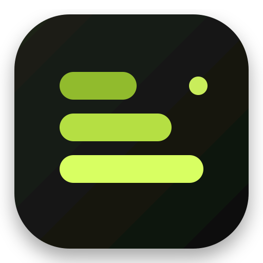
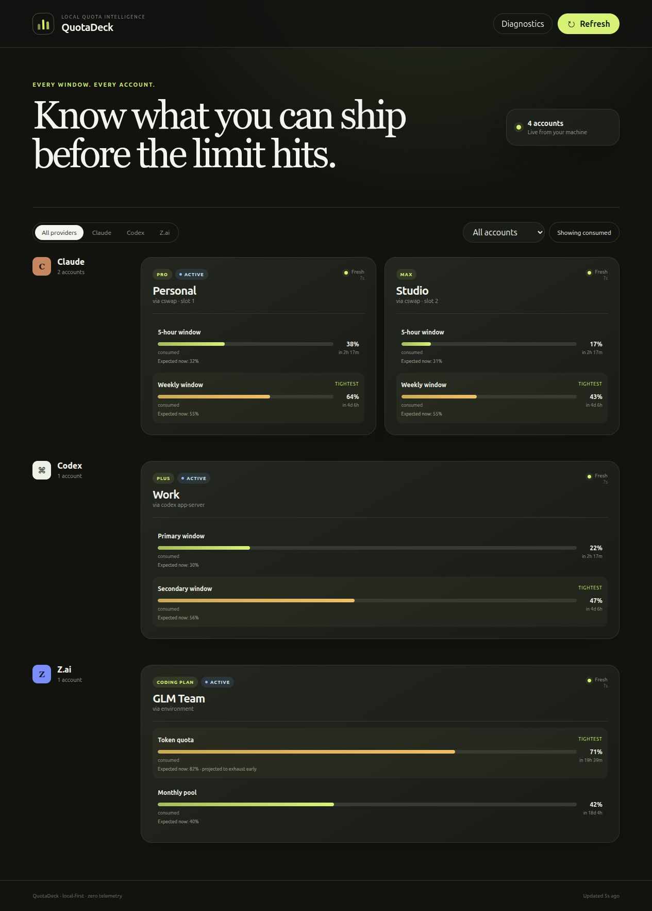

<p align="center">
  
</p>

<h1 align="center">QuotaDeck</h1>

<p align="center">
  Know what you can ship before the limit hits.<br>
  A local-first dashboard for every Claude, Codex, and Z.ai quota window.
</p>

<p align="center">
  <a href="https://github.com/devthefuture-org/quotadeck/actions/workflows/ci.yml"></a>
  <a href="https://github.com/devthefuture-org/quotadeck/actions/workflows/docs.yml"></a>
  <a href="https://github.com/devthefuture-org/quotadeck/releases/latest"></a>
  <a href="LICENSE"></a>
</p>

<p align="center">
  <a href="https://devthefuture-org.github.io/quotadeck/">Documentation</a> ·
  <a href="https://github.com/devthefuture-org/quotadeck/releases/latest">Download</a> ·
  <a href="https://github.com/devthefuture-org/quotadeck/issues/new/choose">Report an issue</a>
</p>



QuotaDeck models `provider → accounts → windows[]`, so new provider-defined windows flow through storage, API, and UI without a `session`/`weekly` hard-code. The daemon binds to loopback, embeds its Preact frontend in one Go binary, stores history in SQLite WAL, streams updates with Server-Sent Events, and sends no telemetry.

The **Plans** screen also controls which subscription new Claude Code sessions use: select any managed Claude account through `cswap`, or configure and activate a Z.ai GLM Coding Plan without editing JSON by hand.

## Install

Download the latest assets from [GitHub Releases](https://github.com/devthefuture-org/quotadeck/releases/latest).

### Debian and Linux Mint

```bash
sudo apt install ./quotadeck_0.1.0_amd64.deb
```

The package contains the CLI/server, native Wails desktop application, systemd user unit, launcher, and Cinnamon panel applet. Open **QuotaDeck** from the application menu after installation.

### Portable AppImage

```bash
chmod +x QuotaDeck-0.1.0-x86_64.AppImage
./QuotaDeck-0.1.0-x86_64.AppImage
```

See the [installation guide](https://devthefuture-org.github.io/quotadeck/getting-started) for the standalone CLI, source builds, and first diagnostics.

## Providers

- **Claude:** `cswap list --json` is the canonical multi-account source. Explicit plan selection calls `cswap switch <slot> --json`; QuotaDeck never calls `cswap export`, opens its credential store, or refreshes Claude OAuth itself.
- **Codex:** one `codex app-server --stdio` process per configured `CODEX_HOME` reads account and rate-limit metadata. QuotaDeck does not read or modify `auth.json`.
- **Z.ai:** explicit environment references, `ZAI_API_KEY`, `GLM_API_KEY`, and recognized Z.ai entries in Claude settings. Tokens never enter the domain model, database, diagnostics, logs, or API responses; in-memory sources are deduplicated with a truncated SHA-256 fingerprint.

Full setup instructions live in the [provider guide](https://devthefuture-org.github.io/quotadeck/providers).

## Build and run

Requirements: Go 1.25+, Node.js 22+, and npm. Linux desktop packaging additionally needs Wails v2, GTK 3, WebKitGTK 4.1, ImageMagick, and `dpkg-deb`.

```bash
npm ci --prefix web
make test
make lint
make build
./dist/quotadeck serve
```

Open <http://127.0.0.1:9211>. For frontend/backend development, use `make dev`. For UI work with synthetic accounts and no provider discovery, use `make demo` and open <http://127.0.0.1:9212>.

## Configuration and CLI

The default configuration is `${XDG_CONFIG_HOME:-~/.config}/quotadeck/config.yaml`; a missing file uses safe defaults. Data is stored at `${XDG_DATA_HOME:-~/.local/share}/quotadeck/quotadeck.db` with 30-day retention and a 60-second polling interval.

```bash
quotadeck doctor
quotadeck refresh
quotadeck status --json
quotadeck service install --user
quotadeck service status
```

`doctor` reports paths, versions, source decisions, and secret-presence booleans only. It never returns token values. See [configuration](https://devthefuture-org.github.io/quotadeck/configuration) and [troubleshooting](https://devthefuture-org.github.io/quotadeck/troubleshooting).

## HTTP API

```text
GET  /api/v1/state
GET  /api/v1/providers
GET  /api/v1/accounts
GET  /api/v1/accounts/{id}/history?from=&to=
GET  /api/v1/health
GET  /api/v1/doctor
GET  /api/v1/events
GET  /api/v1/control
POST /api/v1/refresh
POST /api/v1/control/claude/switch
PUT  /api/v1/control/zai
```

Manual refresh and plan changes are loopback-only and require QuotaDeck's explicit request header. Errors are redacted before persistence; temporary failures keep the last valid windows visible as stale. Control responses expose only secret-presence booleans, never key values.

## Packaging

```bash
make desktop-build
make package-cinnamon
make package-deb
make package-appimage
```

The AppImage toolchain is pinned by version and SHA-256. Release checksums are published alongside every GitHub release.

## Security and contributing

QuotaDeck enforces loopback binding and keeps provider secrets outside domain objects, logs, SQLite, API responses, fixtures, and diagnostics. Read [SECURITY.md](SECURITY.md) before reporting a vulnerability.

Contributions are welcome; start with [CONTRIBUTING.md](CONTRIBUTING.md). Architecture decisions are recorded in [ADR 0001](docs/adr/0001-reference-projects.md) and [ADR 0002](docs/adr/0002-domain-model.md).

MIT licensed.
